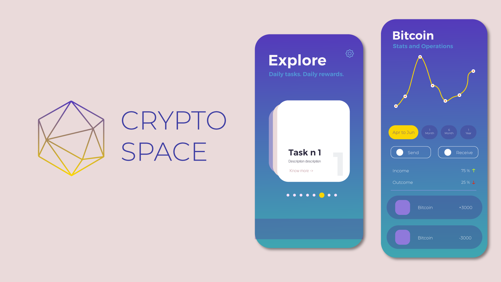

# Cryptospace

  

Les utilisateurs cumulent des tokens de deux manières:
-en effectuant des tâches quotidiennes ou hebdomadaires
-en jouant aux mini-jeux de l'application.
Après avoir atteint un nombre de tokens précis, il pourra troquer ce nombre de points avec un produit ou un service proposé par nos partenaires.
L'application présente d'autres utilité tel que le fait d'être un portefeuille de crypto-monnaies:
-chaque utilisateur de l'application en possède un portefeuille.
-une authentification est nécessaire à chaque ouverture de l'application pour accéder au portefeuille et cela par une empreinte digitale, une authentification faciale ou un code pin.
-L'accès à ce portefeuille permet à l'utilisateur de pouvoir accéder à plusieurs fonctionnalités tel que:
*convertir ses tokens avec un minimum de frais
*faire un dépôt dans son portefeuille
*recevoir ou envoyer de la crypto-monnaie
*consulter son historique de transactions.
-l'application donne aussi la possibilité de consulter les dernières informations de la bitcoin et les autres crypto-monnaies.
